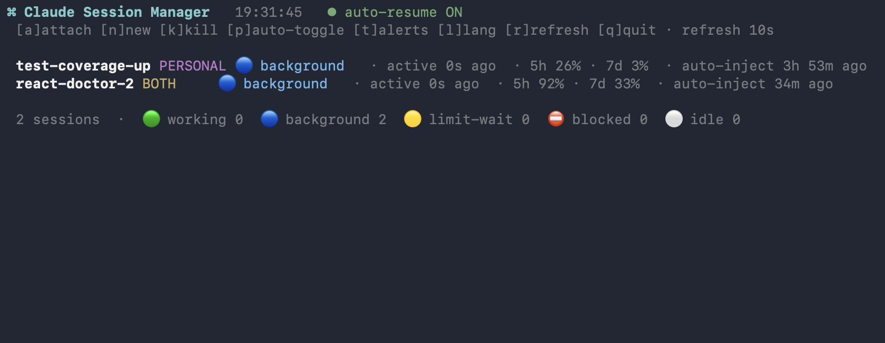

# claude-autoresume

한국어 README: [README.md](README.md)

Run Claude Code long enough and it hits the 5-hour usage limit and stops.
If that happens while you're asleep or away from the keyboard, nobody presses continue when the limit lifts, so the work just sits there.
claude-autoresume notices a session that stopped on the limit and, once the reset time passes, sends it a "continue" message so it picks up where it left off.
It watches many sessions at once, and the csm dashboard shows and controls all of them at a glance.

---

## How it works

Each Claude session runs in its own window of a tmux session called `claude`.
A launchd daemon looks over those windows periodically, and when it sees a limit message it types a "continue" message into that window after the reset time has passed.
Because it works at the terminal level, each window can use a different launch command or profile and it doesn't matter.

It runs on macOS only.
It relies on launchd and BSD `date`.
The UI is English by default, and you can switch it to Korean with the `l` key in csm.
Limit and usage detection is based on the English text Claude prints on screen.

---

## What you need

| Tool | Why | Install |
|---|---|---|
| zsh | the shell functions `cbg`, `cba`, `csm` and friends use zsh-only syntax | default macOS shell |
| tmux | runs each session in a background window the daemon can read and type into | `brew install tmux`, the installer handles it |
| Claude Code CLI | the thing being kept going | must already be installed |
| bash, launchd, osascript | daemon, startup registration, notifications | built into macOS |

Nothing else is required.
It sends no data anywhere and only reads and types into your local terminal.

The shell functions work in zsh only.
oh-my-zsh is a framework on top of zsh, so it works too.
If you use bash as your interactive shell, the functions won't load.
The daemon and dashboard always run under bash, regardless of your interactive shell.

---

## Getting started

```sh
bash ~/Project/claude-autoresume/install.sh   # check tmux, register the daemon, wire up the functions
source ~/.zshrc                                # skip this in a new terminal

cbg job1                                       # start a session
csm                                            # open the dashboard
```

`install.sh` checks that tmux is installed, makes the scripts executable, registers and starts the launchd daemon, and adds the shell functions to `~/.zshrc`.
Wiring up the functions means adding a `source .../shell-functions.zsh` line to `~/.zshrc`, and that line is what makes `cbg`, `cba`, and `csm` available.
See [`.zshrc` setup](#zshrc-setup) below for the details.

This document uses `~/Project/claude-autoresume` as the example path.
If you put it somewhere else, just change the path in the commands.
The scripts find their own location, so the folder can live anywhere.

---

## Everyday commands

These are shell functions, so they only work once `~/.zshrc` sources `shell-functions.zsh`.
`install.sh` adds that line for you; to add it yourself, see [`.zshrc` setup](#zshrc-setup) below.

```sh
cbg <window> [command] [args...]   # run claude in a new window, args after the command pass straight through
cba [window]                       # attach, or pick from the window list if you give no window
cbls                               # list windows
cbpeek <window>                    # peek at the bottom 30 lines of a window
cbk <window>                       # kill one window
cbkill                             # kill everything
csm                                # the session-manager dashboard
```

```sh
cbg job1                             # plain claude
cbg job2 claude --continue           # continue the previous conversation
cbg job3 claude-work --resume        # run through a profile launcher and resume
```

The second argument is the command to run, and everything after it goes to that command unchanged.
Quote anything that contains spaces.
Profile launchers like `claude-work` are covered in the `.zshrc` setup below.
The session starts in whatever folder you ran `cbg` from, so `cd` first if you want a specific one.

If tmux is new to you, three things are enough.
To leave a window you attached to, press `Ctrl-b`, let go, then press `d`.
The session keeps running in the background.
To switch windows, press `Ctrl-b` then a number, or `w` for a list.
Most of the time `cbg`, `cba`, `csm`, and `cbk` cover everything, so you rarely need raw tmux.

---

## The dashboard (csm)



That is the default English UI.
Press `l` to switch to Korean.

Each row is one window and shows, in order, the window name, the profile, the state, the usage left, the last activity time, the last auto-resume time, and whether the window is excluded from auto-resume.

There are five states.

- working — the agent is actually generating a response.
  This state only shows when `esc to interrupt` is on screen.
  Simple changes like typing or the clock ticking don't count as working.
- background — the main view is idle, but a background shell, agent, or workflow is running.
- limit-wait — the session hit the 5-hour limit.
  The daemon continues it once the reset time passes.
- blocked — an org or weekly limit where auto-resume makes no sense.
  It only notifies, and you handle it yourself.
- idle — genuinely stopped and waiting for your input, either finished or asking a question.

The keys are:

- `a` attach after picking a window
- `n` create a new session
- `k` kill a session
- `p` turn per-window auto-resume on or off
- `t` configure per-state alerts
- `l` change the language between en and ko, applied to the daemon too
- `r` refresh, `q` quit

You can pass a refresh interval (`csm 5`), and `csm --once` prints one frame and exits.
In interactive prompts, `esc` cancels and returns to the dashboard.
What empty input does depends on the prompt.
For attach, for example, empty input attaches the whole session.
The dashboard draws on a separate screen, so it doesn't pile up in your scrollback, and your original screen returns when you quit.

The new-session profile list is built on the fly.
It combines the candidates you list in `NEW_SESSION_MENU` in `config.sh` with the `~/.claude-*` config folders it finds in your home directory.
If you use profile launchers, add them to `NEW_SESSION_MENU`.

---

## How it detects limits and resumes

The daemon reads only the bottom part of the screen and sorts limit messages into a few kinds.

| On-screen text | Kind | Daemon action |
|---|---|---|
| `You've used 97% of your session limit` | early warning | ignore |
| `You've hit your session limit · resets 1:40pm` | session limit, text | send "continue" once the reset time passes |
| `Stop and wait for limit to reset` + `Enter to confirm` | session limit, choice menu | pick option 1, then send "continue" after the reset |
| `You've hit your org's monthly spend limit ...` | billing or weekly limit | notify only, don't send anything |

It separates warnings from real limit messages, and because it reads only the bottom of the screen, it won't misread old text that scrolled up after a resume.
It reads the reset time and waits until then, then sends right away.
If it can't read the time, it retries after a short wait.

Sometimes hitting the limit brings up a choice menu.
Typed text doesn't work on a menu, so it uses the arrow keys and Enter to pick "Stop and wait for limit to reset".
The text can linger on screen even after you pick, so it only acts on an open menu where the confirm prompt is also present.
Once the selection is done and the reset passes, it falls through to the normal text-limit path and sends "continue".

---

## Turning auto-resume on and off per window

Sometimes you want to exclude one window and handle it yourself.
In csm, press `p` and enter a window name to toggle it.
Excluded windows show a marker on the dashboard.
You can also list window names, one per line, in `disabled.list`.

---

## Per-state alerts

When a window changes into a state, you get one macOS notification.
By default only limit-wait, blocked, and idle are on.
Working and background change too often, so they're off.
Press `t` in csm to toggle them, and the setting is saved to `notify.conf` and shared with the daemon.
An alert only fires when the state holds steady for two checks in a row, which avoids flicker.

---

## Configuration (`config.sh`)

| Setting | Default | Meaning |
|---|---|---|
| `CONTINUE_PROMPT` | en/ko by language | the "continue" text sent to a session. The default follows the language, and `CAR_CONTINUE_PROMPT` overrides it |
| `RESUME_REGEX` | … | limit text that triggers auto-resume |
| `BLOCKED_NOAUTO_REGEX` | … | text that only notifies, no sending. Add your real weekly-limit wording once you see it |
| `IGNORE_REGEX` | `used NN% of` | early-warning text to ignore |
| `WORKING_REGEX` | `esc to interrupt` | how "working" is detected. Only shown while generating. Adjust here if Claude's wording changes |
| `BACKGROUND_REGEX` | … | how "background" is detected: shells, agents, workflows, sub-agent token counters |
| `LIMIT_MENU_OPT`, `LIMIT_MENU_ACTIVE` | `stop and wait…`, `enter to confirm…` | detects an open limit choice menu |
| `NEW_SESSION_MENU` | `("claude")` | new-session menu candidates |
| `USAGE_REGEX_SHORT`, `USAGE_REGEX_LONG` | `Nh N% left`, `Nd N% left` | usage-left parsing, for a custom statusline only |
| `NOTIFY_WORKING`, `NOTIFY_BACKGROUND` | 0, 0 | alert on change to working, background |
| `NOTIFY_LIMIT`, `NOTIFY_BLOCKED`, `NOTIFY_IDLE` | 1, 1, 1 | alert on change to limit-wait, blocked, idle |
| `INTERVAL` | 60 | check interval, seconds |
| `MIN_RESEND_GAP` | 540 | minimum gap before sending or alerting the same window again, seconds |
| `RESET_BUFFER` | 30 | send this many seconds after the reset time |
| `CAPTURE_LINES` | 20 | how many bottom lines to judge from |

After changing a value, apply it with `launchctl kickstart -k gui/$(id -u)/com.claude-autoresume`.

A few things can also be set through environment variables.

- `CAR_LANG` — the UI language.
  `en` is the default and `ko` is the other option.
  The easiest way is the `l` key in csm.
  Priority is the environment variable, then the `lang` file, then the default en.
- `CAR_SESSION` — the tmux session to watch.
  Default is `claude`.
- `CAR_LABEL` — the launchd label.
  Default is `com.claude-autoresume`.
- `CAR_CONTINUE_PROMPT` — set the "continue" text yourself.
- `CAR_LOCALE` — the locale that forces the daemon to read tmux output as UTF-8.
  Default is `en_US.UTF-8`, and it only applies when the locale is empty or C/POSIX.
- `TMUX_TMPDIR` — the tmux socket location.
  Default is `/tmp`, and leave it as is to share with the daemon.

---

## Managing the daemon

`install.sh` registers it with `RunAtLoad` and `KeepAlive`, so the daemon starts at login and restarts if it dies.

```sh
launchctl list | grep com.claude-autoresume                                   # status
tail -f ~/Project/claude-autoresume/autoresume.log                            # logs
launchctl kickstart -k gui/$(id -u)/com.claude-autoresume                     # apply config, restart
launchctl bootout   gui/$(id -u)/com.claude-autoresume                        # stop
launchctl bootstrap gui/$(id -u) ~/Library/LaunchAgents/com.claude-autoresume.plist  # start
```

After you update the code or settings, re-run `install.sh` or restart the daemon with the `kickstart` above to apply the change.
The daemon reads the script once at startup, so if you edit a file without restarting, the old code keeps running.

---

## Files

- `config.sh` — settings and shared helpers.
  Most tuning happens here.
- `i18n.sh` — the per-language table of UI strings.
  Add or edit wording here.
- `autoresume.sh` — the watcher daemon.
  Try one pass with `bash autoresume.sh --once`.
- `session-manager.sh` — the dashboard, csm.
- `shell-functions.zsh` — the shell functions like cbg, cba, csm.
- `install.sh`, `uninstall.sh` — install and remove.
- `disabled.list` — windows excluded from auto-resume.
  Created at runtime, optional.
- `lang` — the UI language setting.
  Toggled by `l` in csm, created at runtime.
- `notify.conf` — the per-state alert setting.
  Toggled by `t` in csm, created at runtime.
- `autoresume.log`, `state/`, `.sm/` — logs, state, and cache.
  Created at runtime.

`.gitignore` keeps runtime files and personal traces out of the repo.
That covers `state/`, `.sm/`, `disabled.list`, `lang`, `notify.conf`, and the log files.
No usernames, emails, absolute paths, or personal profile names are baked into the code.
Profiles, paths, and the tmux location are all found at runtime.

---

## `.zshrc` setup

`install.sh` adds the line below automatically.
To do it yourself, add it to `~/.zshrc`.
This one line brings in every function, including `cbg`, `cba`, and `csm`.

```sh
source ~/Project/claude-autoresume/shell-functions.zsh
```

After adding it, open a new terminal or run `source ~/.zshrc` to apply it to the current shell.
If you have an old block where `cbg` or `cba` were pasted straight into `~/.zshrc`, delete that block and use the line above instead.

If you run Claude with several accounts or configs, a launcher function per profile is handy.
Then `cbg <window> <function>` uses it, and it also shows up in the new-session menu.

```sh
claude-work()     { CLAUDE_CUSTOM_PROFILE=WORK     command claude --dangerously-skip-permissions "$@"; }
claude-personal() { CLAUDE_CUSTOM_PROFILE=PERSONAL CLAUDE_CONFIG_DIR=~/.claude-personal command claude --dangerously-skip-permissions "$@"; }
```

The `source` line and the profile launchers are independent.
It all works with plain `claude` if you have no launchers.
The profile shown in csm comes from the running process's `CLAUDE_CUSTOM_PROFILE`.
If that's missing it uses the `CLAUDE_CONFIG_DIR` folder name, and if that's missing too it shows default.

---

## statusline setup

The usage-left figures in the dashboard, like `5h 76% · 7d 8%`, are read from Claude's bottom statusline.
The default statusline doesn't have them, so a custom statusline is needed.
Without one the column is simply left out, so it's fine to skip.
If your statusline prints something like `5h N% left / 7d N% left`, csm picks it up automatically.
If the format differs, adjust `USAGE_REGEX_SHORT` and `USAGE_REGEX_LONG` in `config.sh`.

---

## Uninstall

```sh
bash ~/Project/claude-autoresume/uninstall.sh          # remove the daemon and plist
bash ~/Project/claude-autoresume/uninstall.sh --purge  # also delete the folder
```

Remove the `source` line from `~/.zshrc` yourself.
